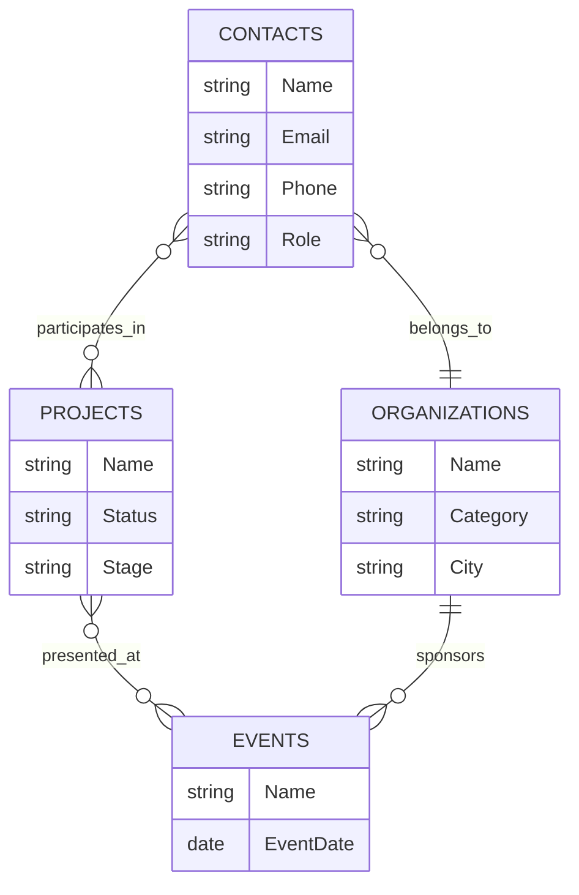

# CRM Data Model

```mermaid
erDiagram

CONTACTS {
  string Name
  string Email
  string Phone
  string Role
}

ORGANIZATIONS {
  string Name
  string Category
  string City
}

PROJECTS {
  string Name
  string Status
  string Stage
}

EVENTS {
  string Name
  date EventDate
}

CONTACTS }o--|| ORGANIZATIONS : belongs_to
CONTACTS }o--o{ PROJECTS : participates_in
PROJECTS }o--o{ EVENTS : presented_at
ORGANIZATIONS ||--o{ EVENTS : sponsors
```
